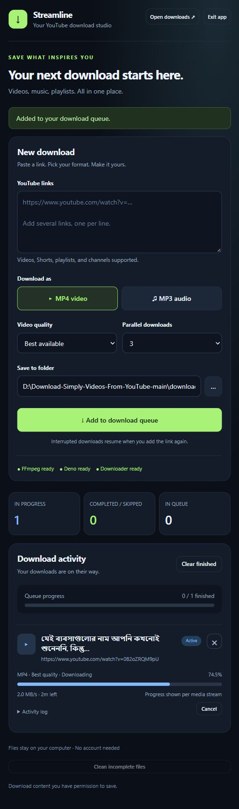

# Streamline — YouTube Download Studio

A local browser dashboard for downloading YouTube videos, Shorts, playlists,
and channels. Choose MP4 video or MP3 audio, watch live progress, and manage
multiple downloads without entering terminal commands each time.



## Features

- MP4 video with best available quality or a 480p–2160p resolution limit.
- MP3 audio at 192 kbps.
- Up to five parallel downloads, with percentage, speed, and time remaining.
- Cancel, retry/resume, and **×** to remove individual queue entries.
- Download archives that skip content already downloaded in the same format.
- A folder picker, **Open downloads**, and confirmed cleanup of incomplete files.
- A local server with no account or hosted service required.
- The original command-line downloader and cleanup tool remain available.

## Platform support

| Platform | Launcher | Verification |
| --- | --- | --- |
| Windows | Double-click `Start Downloader.vbs` | Tested with a complete 4K video download and audio merge |
| macOS | Double-click `Start Downloader.command` | Launcher provided; native testing pending |
| Linux desktop | Run `Start Downloader.sh` | Launcher provided; native testing pending |

The Python app is designed for all three platforms. This project includes
GitHub Actions checks on Windows, Ubuntu, and macOS. A successful workflow run
checks code and offline behavior; it does not verify live YouTube downloads.

Windows launches without a terminal window. On macOS, the `.command` launcher
opens Terminal briefly and starts the dashboard in the background; you can
close that Terminal window afterward. On Linux, double-click behavior depends
on your file manager: mark the script executable and choose **Run** if offered.
You can always start it with `sh "Start Downloader.sh"`.

## One-time setup

Install these prerequisites:

1. [Python](https://www.python.org/downloads/) **3.10 or newer**, with pip and
   virtual-environment support. The project was tested with Python 3.12.
2. [FFmpeg](https://ffmpeg.org/download.html), including `ffprobe`, on your PATH.
   It merges video and audio and converts audio to MP3. Installing a Python
   package named FFmpeg does not install these executables.
3. [Deno](https://docs.deno.com/runtime/getting_started/installation/) on your
   PATH. It supplies the JavaScript runtime used for YouTube challenges. See
   [yt-dlp's runtime instructions](https://github.com/yt-dlp/yt-dlp/wiki/EJS).
4. Optional: [Tkinter](https://docs.python.org/3/library/tkinter.html) for the
   native folder picker. Without it, enter your destination in **Save to folder**.
   On Debian/Ubuntu, Python's Tk and venv support are commonly supplied by
   `python3-tk` and `python3-venv`.

Download or clone the repository and open a terminal in the project folder
for the following setup commands **once**.

### Windows

```powershell
py -3 -m venv venv
.\venv\Scripts\python.exe -m pip install -r requirements.txt
```

If `py` is unavailable, use `python -m venv venv` for the first command.
After setup, double-click **Start Downloader.vbs**. The `.bat` launcher is an
alternative if Windows Script Host is unavailable.

### macOS and Linux

```sh
python3 -m venv venv
./venv/bin/python -m pip install -r requirements.txt
chmod +x "Start Downloader.sh" "Start Downloader.command"
```

Then use the launcher for your platform. Each launcher calls the project's
Python environment directly, so activation is not needed for subsequent starts.
A virtual environment is specific to its computer and operating system:
create a new one after copying the source to another machine.

## Using the dashboard

1. Start the launcher. Your browser opens `http://127.0.0.1:8765/`.
2. Paste one or more links, separated by spaces, commas, or new lines.
3. Choose MP4/MP3, video quality, parallel downloads, and destination folder.
4. Select **Add to download queue**.
5. Follow the progress bar and open **Activity log** for details.

Progress is shown **per media stream**. A video may download its video and
audio streams separately, so the percentage can restart for the audio stream.
The queue summary counts finished entries; an item becomes **Completed** only
after merging or conversion succeeds.

**Cancel** stops a download and leaves its card available for **Retry / resume**.
**×** stops an active download and removes its card. Neither action deletes
completed files or partial files. To resume a removed item, add its link again
using the same destination and format.

Playlists and channels save their videos in named subfolders. Unavailable
entries may be skipped. Existing archives are separate for MP4 and MP3;
requesting a different video resolution does not bypass an existing video archive.

Closing the browser tab leaves the app and downloads running. Use **Exit app**
to stop it. Starting the launcher again reopens the same app. Port 8765 is the
default; if another application occupies it, an available local port is used.

Format, quality, parallel count, and destination are remembered in browser
storage. Queue history is kept only for the current app session. Defaults save
to the project's `downloads/` folder. The app connects to YouTube and may fetch
yt-dlp challenge components from GitHub; an internet connection is required.

## Troubleshooting

| Issue | What to check |
| --- | --- |
| Launcher says the environment is missing | Complete the one-time setup above in this project folder. |
| FFmpeg or Deno shows as missing | Check its installation and PATH, then exit and reopen the app. |
| Folder picker fails | Install Tkinter or type the destination path directly. |
| A download fails | Open its activity log; check the URL, connection, and availability of the video. |
| YouTube extraction or HTTP errors | Update yt-dlp using the command below, then reopen the app. |
| Linux launcher opens as text | Make it executable and enable script execution in your file manager, or launch with `sh`. |

Update Python dependencies:

```powershell
# Windows
.\venv\Scripts\python.exe -m pip install --upgrade -r requirements.txt
```

```sh
# macOS / Linux
./venv/bin/python -m pip install --upgrade -r requirements.txt
```

Unix launcher output is saved to `.streamline.log` in the project folder.
Cleanup is disabled while downloads are active. It removes partial files and
orphaned intermediate streams, discarding their resume progress.

## Command-line tools

Use your environment's Python executable instead of `python` below if needed:

```sh
python download.py
python download.py --list-formats
python cleanup_downloads.py
python gui.py
```

The downloader asks for links, output directory, format, resolution, and
parallel download count. The standalone cleanup tool defaults to `downloads/`
relative to your current working directory.

## Project layout

```text
.
├── gui.py                    # Local server, queue, and workers
├── dashboard.html            # Dashboard interface
├── download.py               # Existing yt-dlp downloader
├── cleanup_downloads.py      # Incomplete-file cleanup
├── Start Downloader.vbs      # Windows launcher
├── Start Downloader.bat      # Windows fallback launcher
├── Start Downloader.command  # macOS launcher
├── Start Downloader.sh       # Linux launcher / Unix startup helper
├── requirements.txt
├── tests/                    # Automated checks
├── docs/images/              # README screenshot
├── .github/workflows/        # Cross-platform checks
├── .gitignore
├── .gitattributes
├── readme.md
└── license.md
```

Run the offline checks from the project root:

```sh
python -m unittest tests.test_gui tests.test_archive_handling tests.test_cleanup_downloads tests.test_filename_limit tests.test_download.TestIgnoreErrorsByContentType -q
```

Other classes in `tests/test_download.py` are live integration tests. Running
the whole test suite contacts YouTube and downloads test media; FFmpeg and
Deno must be installed for those tests.


## Credits and license

Based on [Download Simply Videos From YouTube](https://github.com/pH-7/Download-Simply-Videos-From-YouTube)
by **Pierre-Henry Soria**, with a Streamline dashboard and platform launchers.
The original copyright notice is preserved in [license.md](license.md).
Released under the **MIT License**.

Download content you have permission to save and follow the applicable service terms.
